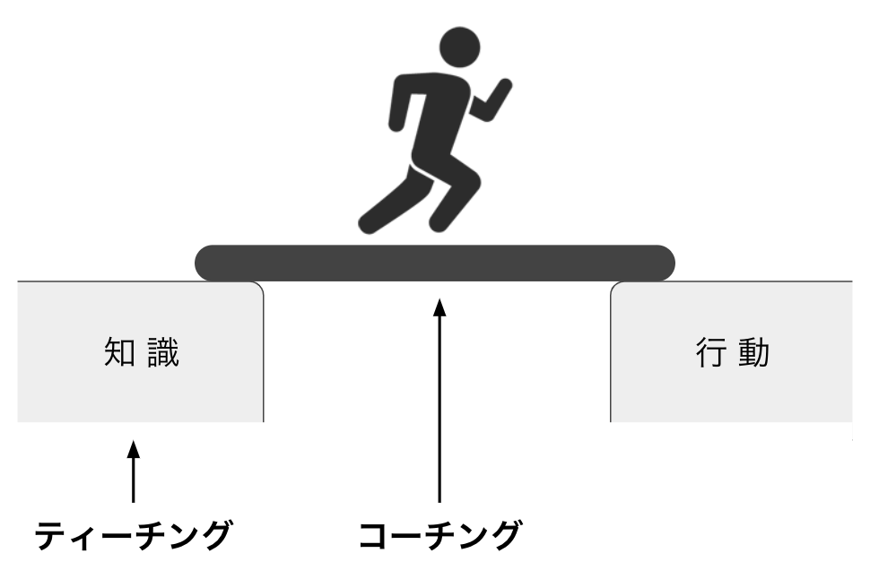

# コーチングの基本

## コーチングの目的

- クライアントの目標達成を支援する
- 知識と行動の間の溝を埋める

- 相手の成長段階を見極めて実践する

  

## コーチングの３原則

- 双方向
- 継続性
- 個別対応

### 双方向

#### オートクライン
- 双方向の大きな目的は、クライアント自身に**オートクライン**を起こしてもらい、気づきを与えること。

  - クライアントが普段から自分に問いかけている質問と同じ質問をしてもオートクラインはなかなか起こらない。
  - クライアントに興味を持ち、クライアントがつまづきやすいポイントは何か、どんな思考パターンを持っているのかを把握する。
  - オートクラインを起こすためには信頼関係が必要。信頼関係を築くためには**自己開示**をする。

#### 問いの使い分け
- **オープンクエスション**
  - 自由回答形式の質問
    - 特定の結果（答え）を念頭におかずに質問する
  - メリット：回答者の言葉で表現される、自分の答えに責任を持つことができる
  - デメリット：回答に時間がかかる、言葉を選ぶのが大変
- **クローズドクエスション**
  - 多肢選択形式の質問
  - メリット：答えるのが容易、様子を伺うことができる
  - デメリット：選択肢に適切な答えがあるかわからない
、真実が見えづらくなることがある
- 使い分け方法
  - コーチングでは基本的に**オープンクエスション**をベースにする
  - クローズドクエスションで相手の様子や感覚を探り、その後オープンクエスチョンや掘り下げる質問で具体化していく
  - 使用例
    - コーチ「現状どう？」　← **オープンクエスチョン**
    - 相手　（沈黙…、話しづらそう）
    - コーチ「どちらかというと、うまくいってる？いってない？」　← **クローズドクエスチョン**
    - 相手「うまくいってないっす」
    - コーチ「どんなことがうまくいってないの？」　← **オープンクエスチョン**
    - 相手「こんなこととか…」「あんなこととか…」
- https://lbj.co.jp/communication/coaching/open-close-question_20210210/

 

### 継続性

 

### 個別対応
